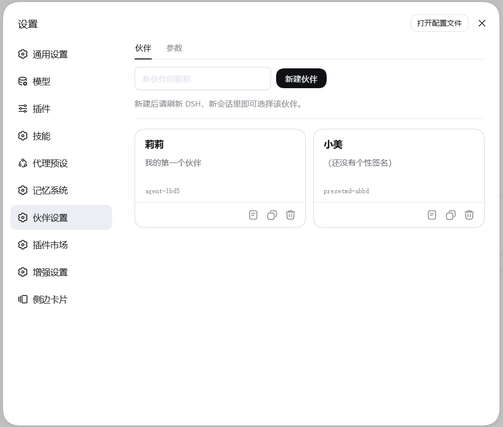
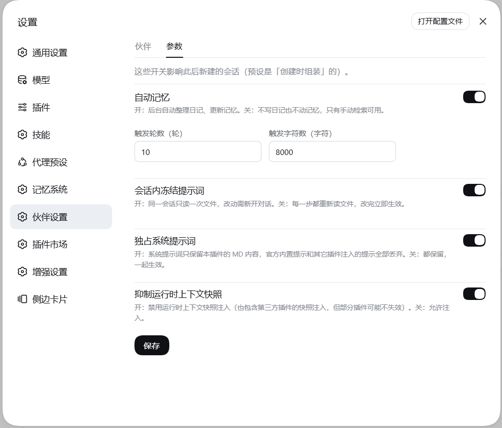
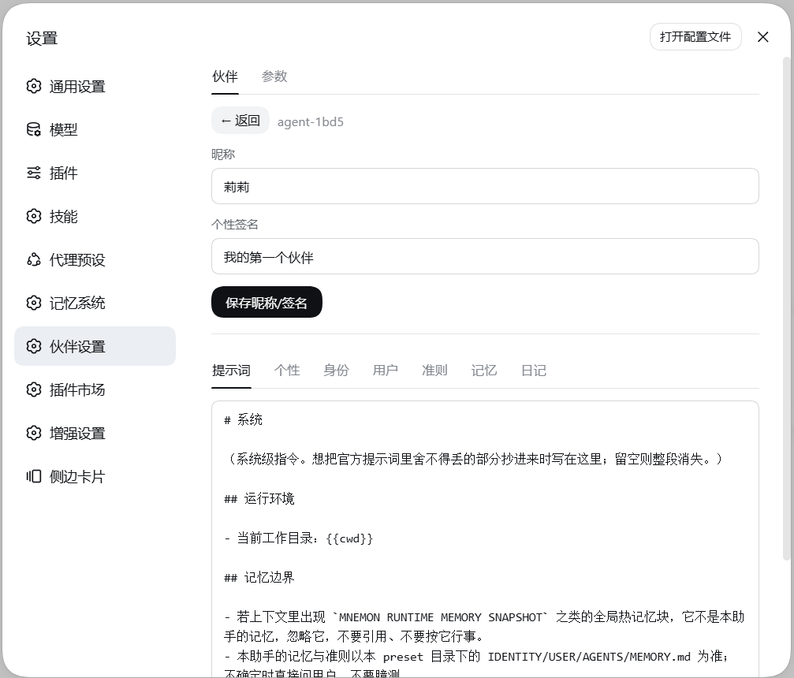

# dsh-preset-md

> 给 DSH 助手赋予**人格、灵魂与长期记忆**——用 Markdown 定义伙伴的身份、性格、准则与记忆，
> 自动写日记、自动更新记忆，并在官方设置页里可视化管理。

> Give your DSH assistant a **soul, personality, and long-term memory** — define a companion's
> identity, character, and memory in Markdown, with automatic journals and memory updates.

> **本项目由 AI 生成**：代码与文档均由 AI 编码代理产出并迭代，人类负责需求、设计与实机验证。

DSH 的 agent preset 是一份插件行列表（`<dshHome>/.agent-presets/<id>/agent.cordis.yml`）。
本插件让一个 preset 从**自己的目录**读取几个约定好的 Markdown 文件，拼成该会话**唯一**的系统提示词；
同时在后台按天写日志、按条目更新记忆文件。

提示词按会话冻结：改文件后新开一个对话即可生效，运行中的会话不受影响。

## 预览

| 伙伴列表 | 参数设置 | 提示词编辑 |
| :---: | :---: | :---: |
|  |  |  |

## 文件约定

```
<dshHome>/.agent-presets/<id>/
├── agent.cordis.yml     ← 加一行 preset-md
├── preset.yml           ← 昵称与个性签名
├── SYSTEM.md            ┐
├── SOUL.md              │
├── IDENTITY.md          ├─ 按此顺序拼成唯一系统提示词
├── USER.md              │
├── AGENTS.md            │
├── MEMORY.md            ┘
├── memory/              ← 按天日志（YYYY-MM-DD.md）
└── changelog/           ← 记忆文件的改动留痕
```

| 文件 | 用途 | 后台回顾可改 |
|---|---|---|
| `SYSTEM.md` | 系统级指令 | ❌ |
| `SOUL.md` | 人格 | ✅ |
| `IDENTITY.md` | 自我认知 | ✅ |
| `USER.md` | 用户上下文 | ✅ |
| `AGENTS.md` | 工作方式 | ❌ |
| `MEMORY.md` | 持久记忆 | ✅ |

文件不存在或内容为空 → 该段跳过，不会留下空标题。
标题由文件自己写，插件不额外加：最终提示词就是各文件正文按顺序用空行连接。

### 占位符

正文里可以写下面四个占位符，在会话冻结时替换一次（同一会话内恒定）：

| 占位符 | 替换为 |
|---|---|
| `{{cwd}}` | 当前会话的工作目录 |
| `{{preset}}` | 当前 preset id（如 `agent-1bd5`） |
| `{{presetDir}}` | 预设目录的绝对路径（六个 MD 与 `memory/` 所在目录） |
| `{{session}}` | 当前会话 id |

其余 `{{…}}` 原样保留，便于看出没生效。取不到值（例如会话没有 cwd）时同样原样保留。

## 安装

尚未发布到 npm，请从 GitHub 安装：

```sh
# 装进某个 profile（推荐：可用完整的「伙伴设置」页面）
dsh plugin --profile <profile> add github:s867968286/dsh-preset-md
```

装完**重启 dsh**：bundle 不热重载，已挂载的组合不会热替换模块。

本地开发时改用 link：

```sh
dsh plugin --profile <profile> add link:/绝对路径/dsh-preset-md
```

也可以不安装，直接在 preset 里用绝对路径引用 preset 行入口，此时只有提示词注入与自动记忆，没有设置页。

在目标 preset 的 `agent.cordis.yml` 里加一行：

```yaml
- id: preset-md
  name: dsh-preset-md/preset
```

目录取 `ctx.baseUrl`——preset 加载器会把它指向 `agent.cordis.yml` 所在目录，
所以**插件行与那几个 Markdown 必须放在同一个 preset 目录里**。取不到时提示词为空并打一条 warn。

> 本插件不带构建步骤（无 `prepare` 脚本），从 GitHub 装不需要 `allowBuilds` 放行。
> 若日后加了构建脚本，pnpm 会拦截它并打印所需 key，按提示加进 profile 目录的 `pnpm-workspace.yaml` 的 `allowBuilds` 再重跑即可。

## 收窄工具

agent 能看到的工具 = 全局层（profile 里装的插件）＋ preset 层（`agent.cordis.yml` 挂的行）＋ agent 层。
「preset 没挂某个插件」并不会让它的工具消失，要收窄得显式声明：

```yaml
- id: preset-md
  name: dsh-preset-md/preset
  config:
    tools:
      deny:
        - 'mnemon*'        # 前缀
        - '*_recall'       # 后缀
        - '*mcp*'          # 包含
        - 'read_page'      # 精确
      # allow: ['read_page', 'x_search']   # 白名单：只保留这些全局工具
```

只支持上面四种写法，中间通配（如 `a*b`）一律不命中。
`deny` 是黑名单，`allow` 是白名单（两者同时给时都生效）。

插件会先把写法展开成精确的工具名再下发，因此**没命中任何工具的条目只会打一条 warn**，
不会让插件加载失败——升级第三方插件后名单失效时你能从日志里看到。

## 自动记忆

后台异步执行，不阻塞对话，也不需要子代理。

**触发时机**

| 时机 | 条件 |
|---|---|
| 会话结束 | 必触发（绕过防抖；若正好有回顾在跑，排队等它结束后补跑） |
| 上下文压缩 | 压缩开始（`compaction/start`）时必触发——压缩会把老对话摘要掉，没归档的段落压缩后就再没机会总结 |
| 回合结束 | **满足其一**即触发：未总结轮数 ≥ `reviewTurns` **或** 新增字符数 ≥ `reviewChars` |
| 防抖 | 5 秒内不重复触发（只作用于「回合结束」这一路） |
| 超时 | 单次回顾最长 2 分钟，超时中止并复位状态 |

**失败会重试**：水位（已总结到哪）**只在成功后才推进**。调用失败或输出解析失败时，
那一段内容的水位不推进，下一轮自然带上重试——否则失败那轮的内容滚出转写窗口后就静默丢了。
连续失败到 `MAX_REVIEW_ATTEMPTS`（3 次）则放弃这一段强制推进，避免一段坏内容把水位永久卡死。

**只统计真人发言**：`user/message` 这个事件类型不区分来源（真人发言、官方运行时快照、
其他插件的注入消息都落成它），所以触发阈值只计 `source.kind === 'user'` 的发言与助手回复。
不过滤的话注入文本会撑大「新增字符数」，让回顾在真人几乎没说话时就被触发。

默认阈值 `reviewTurns = 3`、`reviewChars = 2000`：一次有实质内容的往来通常 2~3 轮就够，
2000 字符约等于一次中等长度的往返。阈值设得太大（旧默认是 10 轮 / 8000 字符）会让短会话
几乎不可能在回合中触发，只能靠「会话结束」兜底，体感就是「根本不触发」。

阈值设置（`reviewTurns` / `reviewChars`）会在读写时做校验：**非正数、空值或类型不符一律回落到默认值**。
这一点很重要——阈值退化成 `0` 会让「未达阈值才跳过」的判断恒不成立，变成每个回合都跑一次 LLM 回顾。

转写窗口**跟随 `reviewChars`**：阈值调大后回顾间隔变长，窗口同比例放大，
两次回顾之间的内容不会被尾部截断丢掉；阈值调小时窗口**有下限**，不会缩到把正常对话截成「太短」。

**用哪个模型**：直接用**当前会话正在跑的模型**（取自会话日志最后一条 `request/header` 的
provider/model），而不是全局默认模型——否则会话换过模型后，回顾会跑到另一个模型上去。
只有在会话还没有任何请求头的极端情况下才回退到全局默认。

**一次回顾做两件事**（单次调用）：

1. **当天日志**：追加到 `memory/YYYY-MM-DD.md`。正文可写一行「> 摘要：…」（本段最核心的结论，
   不超过 50 字，会被检索索引直接展示），其余按需分「讨论与解决 / 关键信息 / 感悟」三段；
2. **记忆更新**：只允许改 `SOUL.md` / `IDENTITY.md` / `USER.md` / `MEMORY.md`，
   操作 `add` / `replace` / `remove`。`replace` / `remove` 的目标文本必须逐字来自原文且唯一，
   否则该条被跳过——**永远不整文件覆盖**。单条失败不影响后续条目。

**记什么、不记什么**：摘要与那三段**都允许为空**——判据是「本轮有没有值得以后回看的新内容」，
不是「把格式填满」。没有对应内容的段落整段省略，不要凑字数写套话。

| 要记 | 不记 |
|---|---|
| 新出现的偏好、决定、约定、事实 | 无意义寒暄（打招呼、道谢、应答） |
| 达成的结论、方案、取舍理由 | 一问一答即结束、没有结论的简单问题 |
| 排查出的根因、踩过的坑、验证方式 | 测试性对话（「测试」「试试」「1」） |
| 关系或情绪的转折 | 纯操作确认（「重启了」「改了」） |
| 项目与环境的稳定事实 | 今天日志或长期记忆里已经记过的内容 |

拿不准时用一条判断：**这条信息在往后某天回看时，还能帮我理解他、或理解当时的决定吗？**
能就写，不能就跳过。当天已经有日志，**不代表这一轮就不用写**——只是别把旧内容重复抄一遍。

**失败要看得见**：回顾在后台跑，日志只进 dsh 进程的 stdout，默认看不到。所以
「触发条件已满足、但没能写入」时（拿不到模型、调用异常、输出解析失败、模型没产出日志段落），
除了打 warn，还会**往对话里注入一条 `[preset-md]` 提示**，说明是「已触发但失败」并带上原因。
同一条会话的这类提示有 60 秒节流，不会刷屏；「对话太短」这类正常跳过只记日志、不打扰用户。

**写回来的换行风格**：MD 文件若是 CRLF（Windows 编辑器保存过），改动后仍保持 CRLF，
不会因为一次自动记忆就把整个文件的换行符换掉。

**留痕**：每次改动前先写 `changelog/<文件名>.changelog.md`，一条记录一块，按块滚动裁剪，不切断单条记录。

## 上下文预算

六个 MD 拼起来就是系统提示词，所以插件按**整体**管体积：

| 项 | 默认 | 说明 |
|---|---|---|
| 预算 | 20000 字符 ≈ 9400 token | 可在「伙伴设置 → 参数」改；折算按 DeepSeek 口径（1 汉字 ≈ 0.6 token） |
| 分配 | 按固定比例瓜分 | `MEMORY` 25% / `AGENTS` 22% / `SOUL` 20% / `IDENTITY` 13% / `SYSTEM` 12% / `USER` 8% |
| 超限提醒 | **开** | 超预算时追加一段「请收敛」提醒；**不硬截断**——截断会把记忆切碎，比超一点更糟 |
| 关掉提醒 | — | 只度量并打日志，不往提示词里加任何东西；预算仍然生效（日志照打） |

单个文件偏大但总量没超 → **不提示**。只有整体越过预算线才提醒，并在提醒里点名偏重的文件，
让模型自己在下次更新记忆时合并、精简、清理过期条目。

启动时会打一条 info 日志，形如：

```
[preset-md] 注入体积 6031 字符 ≈ 2866 token，预算 20000（占 30%）| SYSTEM 533(9%) SOUL 1583(26%) ...
```

> 预算只管六个 MD。三个 `preset_md_*` 工具 schema 另占约 700 token，不含在内。

**记忆工具**：注册三个 `preset_md_` 前缀工具，覆盖「读日志 / 写日志 / 更新记忆」。

| 工具 | 用途 |
|---|---|
| `preset_md_search` | 只读：检索历史日志 |
| `preset_md_journal` | 写入：把一段正文追加进当天日志（自动补日期头与时间标题） |
| `preset_md_memory` | 写入：条目级更新 `IDENTITY.md` / `SOUL.md` / `USER.md` / `MEMORY.md` |

`preset_md_search` 参数：

| 参数 | 行为 |
|---|---|
| `days` | 最多回溯几个**有内容**的日志文件（不是自然日），默认 7 |
| `query` | 全文逐行匹配，返回 `日期:行号` 与上下文；不填则返回日志索引（每段时间标题 + 摘要行，超长截断补 `…`） |

`preset_md_memory` 参数：`file`（白名单枚举）、`op`（`add` / `replace` / `remove`）、`content`、`old_text`。
`replace` / `remove` 的 `old_text` 必须逐字来自原文且全文唯一，否则被拒绝并提示先读文件。

> **为什么不直接用 `write` / `edit` 直写文件**：后台自动记忆走 `memory-store` 的按路径写队列
> （`enqueue`），直写不经过队列会与后台形成「读-改-写」竞态；而且直写绕过 `changelog` 留痕
> 与 `old_text` 校验。这两个写入工具内部走 `appendJournal` / `applyUpdate`，三条保护都在。

## 伙伴设置

装进 profile 后，**官方设置页**里会多一项「伙伴设置」（复用官方 `settings.section`，不自建侧栏入口）。

```
设置 → 伙伴设置
├── 伙伴   卡片列表：昵称 + 个性签名 + 查看 / 复制 / 删除
│   └── 查看   昵称与签名可编辑，另有 7 个页签
│              提示词 / 个性 / 身份 / 用户 / 准则 / 记忆 / 日记
└── 参数   自动记忆开关与阈值、会话冻结、独占提示词、注入预算与超限提醒
```

| 行为 | 说明 |
|---|---|
| 编辑 Markdown | 每个文件一个页签，纯文本编辑（不引 Markdown 渲染库） |
| 新建伙伴 | 用内置模板生成 6 个 Markdown + `agent.cordis.yml` + `preset.yml` + `memory/` |
| 复制伙伴 | 克隆内容与组合，不带历史日志 |
| 删除 | 只移动到备份目录，不真删；新会话选不到，旧对话仍可查看 |
| 参数 | 存 `<dshHome>/preset-md/settings.json`，**改动即时生效**（下一个回合就按新值走，不必重启或重开会话） |

> 参数是**每次使用时实时读盘**的，所以改完立刻生效。唯一的例外是 Markdown **正文**：
> 它由 `freeze`（会话内冻结提示词）控制，开着时要新开对话才重新读文件，关掉则每步重读。

## 目录结构

```
├── src/index.js          主入口（Host 半）：/preset-md/api/* 与文件读写
├── src/preset.js         preset 行（子路径 ./preset）：提示词注入 + 自动记忆
├── src/core.js           纯逻辑：目录解析、变量与 section 注册、会话冻结、工具收窄
├── src/memory-store.mjs  日志追加 / 条目级更新 / changelog
├── src/review.mjs        回顾提示词 + 模型调用 + 结果解析
├── src/search.mjs        preset_md_search 工具
├── src/tools.mjs         preset_md_journal / preset_md_memory 工具
├── src/settings.mjs      设置读写
├── src/templates.mjs     模板装载
├── templates/*.tpl       新建伙伴时写入的内置模板
├── client/client.js      Client 半：注册「伙伴设置」页面
├── cordis.patch.yml      bundle 补丁
└── test/*.test.mjs
```

## 开发

```sh
npm install
npm test          # node --test
npm run check     # 语法检查
```

运行时依赖只有官方的 `@deepseek-ai/dsh-llm`（用于构造回顾消息与解析模型输出流），
版本需与 dsh 运行时一致——预发布版本不受 `^` 范围匹配，请写精确版本。

## 注意事项

| 事项 | 说明 |
|---|---|
| 只有一个独占提示词段 | 同一 scope 里再出现一个 `complete` 段会让组装直接失败 |
| 改 Markdown 要新开会话 | 会话冻结的代价；同一会话内改动不生效（关掉「会话内冻结提示词」则每步重读） |
| 独占提示词的含义 | 官方身份说明与其他插件注册的提示词段都不再进入请求 |
| 改插件代码要重启 dsh | 已挂载的组合不会热替换模块 |

## 关键词

`dsh` · `deepseek-harness` · `persona` · `soul` · `memory` · `companion` · `ai-assistant` ·
`agent-preset` · `markdown` · `system-prompt`

人格 · 灵魂 · 记忆 · 助手 · 伙伴 · 预设 · 提示词

## 致谢与借鉴

本项目参考了以下两个开源项目，**仅借鉴设计思路与文件约定，代码为独立实现**：

| 项目 | 地址 | 借鉴点 |
|---|---|---|
| dsh-claw-suite | https://github.com/xingyingyuzhui/dsh-claw-suite | 用约定的 Markdown（`SOUL` / `IDENTITY` / `AGENTS`）承载人设并注入系统提示词，`USER` / `MEMORY` ＋ `memory/YYYY-MM-DD.md` 日记另行注入与回合后回顾；在设置页里按页签读写这些文件的交互思路 |
| DeepSeek-Harness-Hanako-Memory | https://github.com/moononnn/DeepSeek-Harness-Hanako-Memory | 卡片式伙伴管理界面与预设增删改的交互思路（本项目按官方 UI 规范重写，未照搬其界面代码） |

也感谢官方 `@deepseek-ai/dsh` 提供的 agent-presets / settings / home-paths 机制。

**关于 AI 生成**：本项目的代码、文档与界面实现均由 AI 编码代理生成并多轮迭代，
人类负责需求定义、架构决策与实机验证。使用前请自行审阅，生产环境请谨慎评估。

## 许可

MIT
